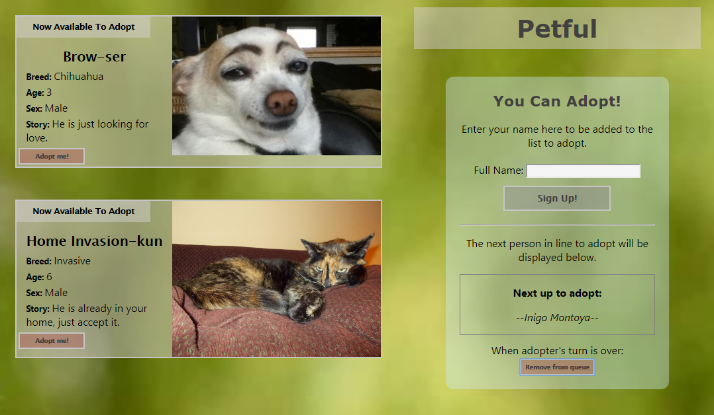

# Petful
Petful is a unique animal adoption program committed to making sure that their cats and dogs
get a new home as quickly as possible. Their policy is that all animals are adopted in the order they arrive. The next cat or dog available for adoption is always the one that has been with them the longest.

## Screen shots of the app

### Link to the live app
https://petfulv111.ljelias.now.sh

--------------------------------------------------
### About this app
This project was a one-day app building challenge of the Thinkful curriculum.

### Collaborators:
  Shawn Collette
  Laura Elias

### This app is built with:
- React
- HTML5
- CSS3
--------------------------------------------------
